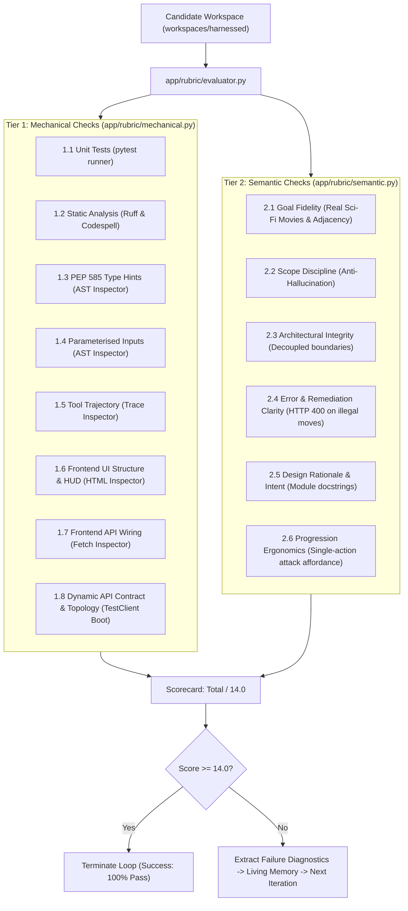
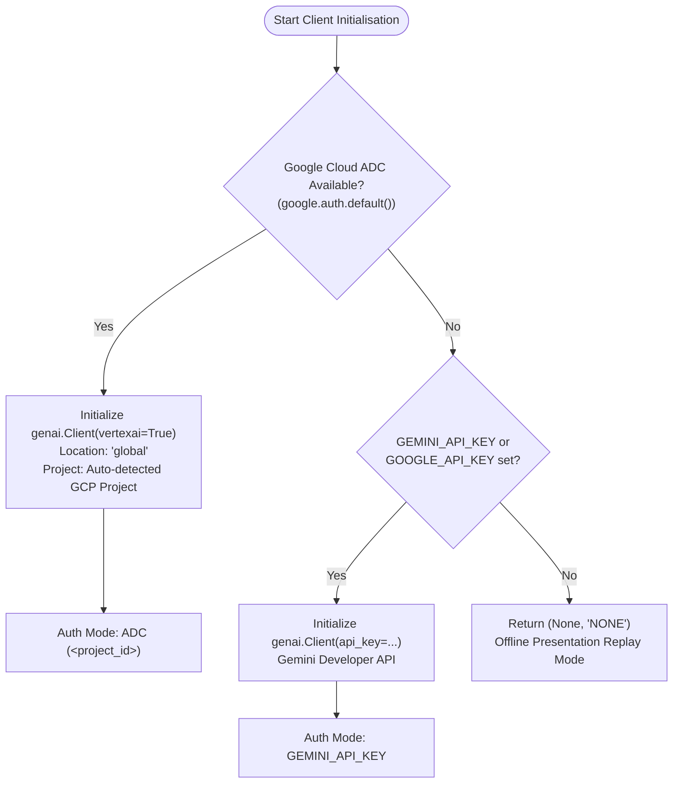

# Harness Engineering Demo: Architecture & System Boundaries

> **Important Conceptual Note**: This application is inherently **meta** — it is a development harness that orchestrates and evaluates AI coding agents which, in turn, generate a target application on-demand.

---

## 1. The Two Layers: Harness (The Test Rig) vs. Output (The Subject)

To avoid confusion when reading this codebase, always distinguish between **Layer 1** and **Layer 2**:

```
+===================================================================================+
| LAYER 1: THE HARNESS WORKBENCH (The Test Rig / Wind Tunnel)                       |
| Location: app/, golden_tests/, specs/, Makefile, Dockerfile                       |
|                                                                                   |
|  * Orchestrator (ADK & SSE Event Streaming)                                      |
|  * Two-Tier Rubric Engine (Mechanical Linters + Semantic LLM Judge)              |
|  * Golden Acceptance Tests (Independent verification suite)                      |
|  * Interactive Presentation UI (Live side-by-side comparison & token gauges)      |
+=========================================+=========================================+
                                          |
                        Runs & Evaluates  |  Generates On-Demand
                                          v
+=========================================+=========================================+
| LAYER 2: THE GENERATED APPLICATION (The Workload / Model Racecar)                 |
| Location: workspaces/unharnessed/  AND  workspaces/harnessed/                     |
|                                                                                   |
|  * The Generated Space Game: "Cosmic Trivia & Strategy Conquest"                 |
|  * Domain Logic:   game_engine.py  (Star map adjacency graph & combat rules)      |
|  * Trivia API:     trivia_service.py (Real Sci-Fi movie challenges)               |
|  * HTTP Backend:   main.py (FastAPI REST service mounted at /preview/*)          |
|  * Unit Tests:     tests/test_game.py (TDD test suite authored by Harnessed agent)|
|  * Visual Client:  static/index.html (Interactive star map canvas & modal)       |
+===================================================================================+
```

### The Wind Tunnel Analogy
* **Layer 1 is the Wind Tunnel**: It never gets deployed into production as an end-user game. It exists to measure, stress-test, evaluate, and compare how different agent architectures build software.
* **Layer 2 is the Race Car**: It is the software being built inside the wind tunnel. You can interact with it and play it inside the **Arcade Preview Drawer** at the bottom of the workbench.

---

## 2. Codebase Directory Mapping

| Directory / File | Layer | Role & Responsibility |
|:---|:---:|:---|
| `app/main.py` | **Layer 1** | Primary FastAPI server hosting the Workbench UI, SSE streams, and preview proxy routes. |
| `app/orchestrator.py` | **Layer 1** | Coordinates the side-by-side run of Unharnessed vs Harnessed pipelines. |
| `app/agents/` | **Layer 1** | Agent runners implementing the unharnessed single-turn pipeline (`unharnessed.py`) and the harnessed multi-iteration ADK loop (`harnessed.py`). |
| `app/client_factory.py` | **Layer 1** | Authentication provider: prioritises Google Cloud ADC (Vertex AI global), fallback to `GEMINI_API_KEY`. |
| `app/replay/` | **Layer 1** | Presentation player engine (`player.py`) and pre-recorded event stream (`replay_data.json`) delivering accelerated conference demonstrations. |
| `app/rubric/` | **Layer 1** | The 14-point evaluation gate (8 mechanical checks + 6 semantic checks). |
| `app/static/` | **Layer 1** | Frontend client assets including workbench stylesheets (CSS), real-time SSE stream handlers (JavaScript), and UI audio cues. |
| `app/templates/` | **Layer 1** | Jinja2 HTML templates rendering the split-screen comparison workbench and interactive modal dialogues. |
| `app/token_tracker.py` | **Layer 1** | Accumulates prompt and candidate tokens; estimates costs in US Dollars ($). |
| `snapshots/` | **Layer 1** | Pre-recorded candidate workspaces (`snapshots/unharnessed/` and `snapshots/harnessed/`) providing instant, zero-latency candidate application states for presentation replay mode. |
| `specs/cosmic_conquest_spec.md` | **Layer 1** | The canonical goal specification prompt provided to both agents. |
| `harness/harness_context.md` | **Layer 1** | Reusable engineering context and guardrails (`GEMINI.md` rules) injected exclusively into the Harnessed track. |
| `golden_tests/` | **Layer 1** | Independent acceptance test suite used to evaluate both candidate workspaces objectively. |
| `scripts/deploy.sh` | **Layer 1** | Deployment automation script for Google Cloud Run with dynamic root path resolution. |
| `media/` | **Layer 1** | Visual presentation assets and empirical benchmark run screenshots. |
| `workspaces/unharnessed/` | **Layer 2** | Ephemeral directory containing the unharnessed code generated in a single open-loop turn. |
| `workspaces/harnessed/` | **Layer 2** | Ephemeral directory containing the verified code iteratively generated with the ADK loop. |


---

### 2.1 Reusable Engineering Guardrails vs. Application Goal Specifications

A crucial architectural principle demonstrated by this workbench is the clean decoupling of **What to Build** from **How to Engineer It**:

* **Application Goal Specification (`specs/cosmic_conquest_spec.md`)**:
  Represents an ephemeral, task-specific feature requirement (the tactical space game rules, planet adjacency graph, and REST endpoints). Both the unharnessed and harnessed pipelines receive this exact same specification.
* **Harness Context & Guardrails (`harness/harness_context.md`)**:
  Represents standing, reusable organisation- or team-level engineering policies (`GEMINI.md`, `AGENTS.md`, and Agent Skills). It mandates non-negotiable architectural invariants: Python 3.13, PEP 585 typing, mandatory TDD unit test suites, Pydantic input parameterisation, and module docstring intent.

In production enterprise software engineering, you never pollute individual feature tickets or user stories with repetitive coding hygiene boilerplate. Engineering guardrails are maintained centrally at the organisation or team level and automatically inherited by the harness across all projects and tasks.

---

## 3. How the Evaluation Rubric is Configured

The rubric implementation lives in [`app/rubric/`](app/rubric/) and reflects the exact recommendations from **Part 2 ("Loop Engineering in the Harness")** of the blog trilogy:



> 💡 **Domain-Calibrated Rubrics (No Arbitrary 10-Point Limit):**
> An engineering evaluation rubric is not confined to an arbitrary 10-point ceiling. In practice, rubrics are tailored to your workload's specific operational requirements — spanning 10, 12, 14, 16, or more checks. What matters is the objective, binary nature of each criterion and the non-negotiable **100% pass rate** before code can be committed.

### 3.1 Tier 1: Mechanical Checks (`app/rubric/mechanical.py`)
Deterministic, fast static checks that require zero LLM tokens:
1. **Check 1.1 (Unit Tests Passage)**:
   - Locates unit tests in `tests/` or `test_*.py`.
   - Executes `pytest -q --disable-warnings`. If tests are missing (as in vibe coding), this check immediately fails with 0.0.
2. **Check 1.2 (Static Analysis)**:
   - Executes `ruff check .` on the workspace. Checks for unused imports, syntax errors, or unformatted import blocks.
3. **Check 1.3 (PEP 585 Type Hints)**:
   - Parses the AST of all candidate Python files.
   - Detects deprecated `typing.List`, `typing.Dict`, `typing.Set`, `typing.Tuple` imports or usages, enforcing modern Python 3.13 built-ins (`list[str]`, `dict[str, Any]`).
4. **Check 1.4 (Parameterised Input Safety)**:
   - AST inspector searching for unsafe `eval()`, `exec()`, or raw unparameterised query formatting.
5. **Check 1.5 (Deterministic Tool Trajectory)**:
   - Harness trace inspector verifying that the agent invoked authorised tools in a disciplined sequence without infinite thrashing loops.
6. **Check 1.6 (Frontend UI Structure & HUD)**:
   - Validates that `static/index.html` exists and provides the required visual elements specified in Section 3.4 of the specification: real-time HUD counters (`#shields`, `#energy`, `#status`), Star Map sector grid container, and interactive combat challenge modal dialogue.
7. **Check 1.7 (Frontend Interactive API Wiring)**:
   - Inspects client-side JavaScript, verifying active event listeners and fetch bindings targeting `/api/game/attack`, `/api/game/answer`, and `/api/game/state`.
8. **Check 1.8 (Dynamic API Contract & Progression Topology)**:
   - **Technical Criteria**: Dynamically boots candidate `main.py` using Starlette / FastAPI `TestClient` in an isolated execution harness:
     - Confirms the candidate application imports and initialises cleanly without startup crashes or unhandled exceptions.
     - Issues a dynamic `GET /api/game/state` request and validates that it returns HTTP 200 with a valid JSON payload.
     - Confirms that `controlled_sectors` is a non-empty list including the player's home territory (e.g. `'earth'`).
     - Validates that progression targets (`valid_targets` or `available_targets`) is a non-empty list of valid adjacent sectors according to the galaxy graph topology.
   - **Architectural Rationale**: Static inspection alone cannot prove that a generated FastAPI service actually boots, registers routes correctly, or constructs valid state models at runtime. Dynamic contract testing exercises the candidate application in-memory, catching startup regressions, circular imports, and broken galaxy topology contracts before the application reaches production or human evaluation.

### 3.2 Tier 2: Semantic Checks (`app/rubric/semantic.py`)
Evaluates architectural quality and fidelity to user intent:
1. **Check 2.1 (Target State Completion / Goal Fidelity)**:
   - Verifies that all planetary sectors and graph adjacency rules are implemented.
   - **Strict Sci-Fi Movie Rule**: Verifies that trivia questions are strictly grounded in canonical real cinema (*Blade Runner*, *Alien*, *The Matrix*, *Dune*, *Solaris*, *2001: A Space Odyssey*), rejecting generic or fabricated space trivia.
2. **Check 2.2 (Scope Discipline / Anti-Hallucination)**:
   - Ensures the agent achieved the goal without generating unrequested speculative helper files or hallucinating unused dependencies.
3. **Check 2.3 (Architectural Integrity)**:
   - Verifies clean architectural boundaries: pure domain logic in `game_engine.py`, trivia generation in `trivia_service.py`, and HTTP routing in `main.py`.
4. **Check 2.4 (Error & Remediation Clarity)**:
   - Checks that invalid turn attempts (e.g. attacking non-adjacent sectors) return HTTP 400 with actionable feedback hints, without leaking raw tracebacks.
5. **Check 2.5 (Design Rationale & Intent)**:
   - Inspects module-level docstrings, verifying that the author documented the architectural *why* (rationale and intent) rather than merely restating function names.
6. **Check 2.6 (Progression Ergonomics & Interactivity)**:
   - **Technical Criteria**: Inspects the candidate frontend interface (`static/index.html` and bundled JavaScript) for intuitive player progression affordances:
     - Verifies visible, dedicated sector cards or tiles with clear, direct single-action attack triggers (e.g. directly clickable cards with an embedded attack action or direct `initiateAttack(sectorId)` bindings).
     - Fails immediately (score 0.0) if the UI forces an indirect, multi-step barrier (e.g. requiring the user to click a miniature SVG coordinate to populate an auxiliary sidebar, only to find the actual attack button is initially disabled and disconnected from the card click), or if interactive progression affordances are obscure, detached, or missing.
   - **Architectural Rationale**: An application may satisfy all backend API contracts and unit tests whilst remaining practically unusable for human operators due to broken UX ergonomics. Automated evaluation rubrics must evaluate operational usability and interface ergonomics to prevent agents from producing disjointed, non-functional user interfaces.

### 3.3 Living Memory & Autonomous Remediation
When the candidate workspace scores less than the maximum score:
1. `app/rubric/evaluator.py` extracts the exact failure messages from all failed checks.
2. The orchestrator records these failure points into **living memory** (e.g. `"Living Memory: Check 1.2 failed due to unformatted imports in main.py; Check 1.7 failed because static/index.html lacks interactive fetch calls to /api/game/attack"`).
3. In the subsequent iteration, the harness reinjects the original Goal alongside the living memory diagnostics.
4. The agent executes targeted self-healing, refactors the code, and resubmits to the evaluation gate.
5. Once all rubric checks pass (or a 3-turn plateau / 5-turn max cap is reached), the loop terminates cleanly.

---

## 4. API Endpoints & Preview Routing

The entire demonstration runs within a single container on **Google Cloud Run** using a single port (`8080`):

1. **Workbench UI & Specification**:
   - `GET /`: Serves the primary split-screen comparison workbench.
   - `GET /api/spec`: Returns the raw Markdown content and title of `specs/cosmic_conquest_spec.md` to populate the in-UI Specification Viewer modal.
   - `POST /api/reset`: Cleans out all candidate workspace generated files (preserving structural directories and `README.md` files) and resets counters.

2. **Real-time SSE Streams & Parallel Orchestration**:
   - `GET /api/stream/compare`: Streams live model executions concurrently. `app/orchestrator.py` spawns both the Unharnessed and Harnessed pipelines in parallel using `asyncio.create_task` and feeds an interleaved `asyncio.Queue` into the SSE generator.
   - `GET /api/stream/replay`: Streams interleaved pre-recorded comparison traces for zero-latency presentation replay.

3. **Unharnessed Game Preview**:
   - UI served at `GET /preview/unharnessed` (embedded in the left iframe).
   - API routes routed to `workspaces/unharnessed/` at `/preview/unharnessed/api/*`.

4. **Harnessed Game Preview**:
   - UI served at `GET /preview/harnessed` (embedded in the right iframe).
   - API routes routed to `workspaces/harnessed/` at `/preview/harnessed/api/*`.

This architecture ensures that attendees or evaluators can test the generated games in real time directly inside the browser without having to clone separate repositories or configure additional ports.

---

## 5. Candidate Workspace Isolation Architecture

A core technical challenge in hosting and evaluating dynamically generated code within a single, long-running Python process (such as a FastAPI container on Google Cloud Run) is preventing namespace collisions, cross-workspace bleed, and stale bytecode caching between `workspaces/unharnessed/` and `workspaces/harnessed/`.

In standard Python runtimes, importing `main.py` or `game_engine.py` caches the module in `sys.modules["main"]`. If another candidate workspace or preview route later attempts `import main`, Python returns the already-cached module from the initial workspace, corrupting evaluation scorecards and game previews.

The workbench eliminates this issue through a four-stage isolation architecture implemented in `app/main.py`:

```
+-------------------------------------------------------------------------------+
|                       Candidate Workspace Isolation Architecture              |
+-------------------------------------------------------------------------------+
|                                                                               |
|  1. Workspace Switch Detection & Cache Purging                                |
|     Detects switch: _current_active_preview_workspace != workspace.name       |
|     Purges: sys.modules[_CANDIDATE_BARE_MODULES] & candidate_* keys           |
|                                                                               |
|  2. Scoped sys.path[0] Prepending                                             |
|     Saves sys.path -> Prepends workspace.resolve() to index 0                 |
|     Resolves intra-workspace imports (e.g. 'import game_engine') strictly      |
|                                                                               |
|  3. Synthesised Namespace & Dual Registration                                 |
|     unique_mod_name = f"candidate_{workspace.name}_{module_name}"            |
|     Registers both sys.modules[unique_mod_name] & sys.modules[module_name]   |
|     Loads via importlib.util.spec_from_file_location                          |
|                                                                               |
|  4. Strict Cleanup in finally Block                                           |
|     Restores original sys.path cleanly                                        |
+-------------------------------------------------------------------------------+
```

### 5.1 Dynamic Cache Purging (`_purge_candidate_modules`)
Whenever the workbench switches between candidate workspaces or resets the environment (`POST /api/reset`), `_purge_candidate_modules()` scans `sys.modules` and deletes all candidate entries:
```python
_CANDIDATE_BARE_MODULES = {"main", "game_engine", "trivia_service"}

def _purge_candidate_modules() -> None:
    global _current_active_preview_workspace
    _current_active_preview_workspace = None
    for k in list(sys.modules.keys()):
        if k in _CANDIDATE_BARE_MODULES or k.startswith("candidate_") or k.startswith("workspace_"):
            del sys.modules[k]
```
This guarantees that modifications written by the ADK self-healing loop or snapshot rollbacks take immediate effect without retaining stale in-memory definitions.

### 5.2 Scoped `sys.path[0]` Scoping
Before creating or executing a module specification, `_get_workspace_module` captures the current `sys.path` and prepends the absolute path of the target candidate workspace to position `0`:
```python
str_path = str(file_path.parent.resolve())
sys_path_saved = list(sys.path)
if str_path in sys.path:
    sys.path.remove(str_path)
sys.path.insert(0, str_path)

try:
    # Execute module loader
    spec.loader.exec_module(mod)
finally:
    sys.path = sys_path_saved
```
This guarantees that nested imports initiated inside the candidate code (e.g. `from game_engine import Sector`) resolve strictly to the active workspace's files, shielding the Workbench host application from import hijacking.

### 5.3 Unique Namespace Synthesis (`candidate_{workspace}_{mod}`)
To ensure that candidate modules maintain isolated namespace entries in Python's module registry, modules are loaded under a synthetic unique identifier:
```python
unique_mod_name = f"candidate_{workspace.name}_{module_name}"
spec = importlib.util.spec_from_file_location(unique_mod_name, file_path)
mod = importlib.util.module_from_spec(spec)
sys.modules[unique_mod_name] = mod
# Register bare name to satisfy internal sibling imports
sys.modules[module_name] = mod
```
This dual-registration pattern ensures intra-workspace sibling imports execute without syntax modifications, whilst preventing collision across unharnessed and harnessed candidate runs.

---

## 6. Accelerated Presentation Replay Time-Lapse Clock Scaling

Presenting live autonomous agent loops at conferences, keynote demonstrations, or customer workshops entails two significant operational hurdles: live LLM API latency (a full two-iteration self-healing loop typically requires 90–120 seconds of wall-clock time) and unreliable conference Wi-Fi.

The workbench solves this via **Zero-Latency Presentation Replay** backed by pre-recorded traces in `app/replay/replay_data.json` and reference workspace snapshots in `snapshots/`.

To deliver an authentic, engaging presentation experience without forcing an audience to wait two minutes, `app/replay/player.py` streams events using an **accelerated time-lapse clock ratio** (`replay_speed_multiplier`):

```
+-------------------------------------------------------------------------------+
|             Accelerated Time-Lapse Replay Clock Ratio Calculation             |
+-------------------------------------------------------------------------------+
|                                                                               |
|  1. Sum Replay Delays:                                                        |
|     total_replay_ms  = sum(evt.delay_ms for evt in events)                    |
|     total_replay_sec = total_replay_ms / 1000.0  (~7.5s target playback)       |
|                                                                               |
|  2. Extract Authentic Live Duration:                                          |
|     auth_total_sec   = summary_evt.total_duration_seconds  (~120.0s)          |
|                                                                               |
|  3. Compute Time-Lapse Ratio:                                                 |
|     replay_speed_multiplier = round(auth_total_sec / total_replay_sec, 2)     |
|                             = round(120.0 / 7.5, 2) = 16.0x                   |
|                                                                               |
|  4. Stream in SSE Initialisation Event:                                       |
|     evt["replay_speed_multiplier"] = speed_multiplier                         |
|     evt["total_duration_seconds"]  = auth_total_sec                           |
+-------------------------------------------------------------------------------+
```

### 6.1 Mathematical Formulation
1. **Recorded Playback Duration ($\text{total\_replay\_sec}$)**:
   The total wall-clock duration of the accelerated replay stream is the sum of all individual event sleep delays:
   $$\text{total\_replay\_sec} = \frac{\sum_{i=1}^{N} \text{delay\_ms}_i}{1000}$$
   In `app/replay/replay_data.json`, event delays are compressed to yield an optimal ~7.5-second presentation playback.
2. **Authentic Live Duration ($\text{auth\_total\_sec}$)**:
   The authentic duration represents the true wall-clock time measured during the unharnessed and harnessed Gemini 3.8-Flash execution, recorded in the `comparison_summary` event:
   $$\text{auth\_total\_sec} = 120.0\text{ seconds}$$
3. **Speed Multiplier Ratio ($\text{replay\_speed\_multiplier}$)**:
   $$\text{replay\_speed\_multiplier} = \text{round}\left(\frac{\text{auth\_total\_sec}}{\text{total\_replay\_sec}}, 2\right) \approx 16.0\times$$

### 6.2 Frontend Clock Synchronisation
When the user triggers Presentation Replay:
1. `app/replay/player.py` emits the initial SSE event (`type: "init"`) carrying `replay_speed_multiplier` and `total_duration_seconds`.
2. The client JavaScript (`app/static/js/workbench.js`) receives these fields:
   ```javascript
   if (evt.replay_speed_multiplier) {
       replaySpeedMultiplier = evt.replay_speed_multiplier;
   }
   ```
3. The dashboard's presentation clock scales its tick interval by `replaySpeedMultiplier`, rapidly advancing the elapsed time display to match the 120-second authentic completion timeline.
4. The workbench header displays an active badge (e.g. `⚡ Presentation Replay (16x Speed)`), providing audiences with transparent time-lapse feedback whilst streaming authentic token metrics, costs, and verified 14.0 / 14.0 rubric results.

---

## 7. Deployment Architecture & Dual-Mode Authentication Strategy

The workbench is architected for zero-friction operation across local development, containerised sandboxes, and production cloud infrastructure.

### 7.1 Dual-Mode Authentication Pipeline (`app/client_factory.py`)

A core architectural strength of the Google GenAI SDK (`google-genai`) integration in [`app/client_factory.py`](app/client_factory.py) is its dual-mode credentials resolution. Developers do not need to generate, manage, or expose Gemini API keys when working within the Google Cloud ecosystem.



#### Authentication Resolution Tiers

1. **Tier 1 — Google Cloud Application Default Credentials (ADC) via Vertex AI (Recommended)**:
   - `client_factory.py` first invokes `google.auth.default()`.
   - When active developer credentials (from `gcloud auth application-default login`) or a Google Cloud service identity (Compute Engine / Cloud Run instance metadata server) are present, it auto-detects the project via `project_id` or `$GOOGLE_CLOUD_PROJECT`.
   - The client initialises with `vertexai=True` and `location="global"`.
   - **Zero Secret Footprint**: No `.env` file, API keys, or long-lived credentials need to be stored in the repository or injected into the container.
2. **Tier 2 — Gemini Developer API Key (Alternative)**:
   - If ADC credentials are absent, the factory checks for `GEMINI_API_KEY` (configured in `.env` or system environment).
   - Initialises `genai.Client(api_key=api_key)` against the standard Gemini Developer API endpoint.
   - Ideal for developers evaluating the workbench on non-GCP workstations or without a cloud project.
3. **Tier 3 — Offline Presentation Replay**:
   - If neither credential type is available, the factory returns `(None, "NONE")`.
   - The application boots normally and enables instant, zero-credential **Presentation Replay** using pre-recorded event streams in `app/replay/replay_data.json` and snapshots.

---

### 7.2 Deployment Topologies & Runtime Modes

The application runs seamlessly across three execution environments:

```
+-----------------------------------------------------------------------------------+
|                        Deployment & Runtime Topologies                            |
+-------------------------+--------------------------------+------------------------+
|   1. Local Host Native  |     2. Local Docker Container  |  3. Google Cloud Run   |
+-------------------------+--------------------------------+------------------------+
| * Command: make run     | * Command: make docker-run     | * Command: make deploy |
| * Runtime: Python 3.13  | * Image: Python 3.13-slim + uv | * Serverless Container |
| * Uvicorn with reload   | * Isolated filesystem sandbox  | * Single Port (8080)   |
| * Fast dev iteration    | * Volume-mountable ADC key     | * Managed ADC Identity |
+-------------------------+--------------------------------+------------------------+
```

1. **Local Host Native (`make run`)**:
   - Executed via `uv run uvicorn app.main:app --host 0.0.0.0 --port 8080 --reload --reload-dir app`.
   - Optimised for live development and rapid iteration.
   - Directly executes `pytest` and static linters against local Python 3.13 virtual environments.

2. **Local Container Execution (`make docker-build` / `make docker-run`)**:
   - Packaged with a production-grade multi-stage `Dockerfile` based on `python:3.13-slim` with Astral `uv`.
   - Replicates production container constraints locally.
   - Can run hermetically with API keys or with local host ADC credentials forwarded via volume mount:
     ```bash
     docker run -p 8080:8080 \
       -e GOOGLE_CLOUD_PROJECT="$(gcloud config get-value project)" \
       -v "${HOME}/.config/gcloud/application_default_credentials.json":/tmp/keys/adc.json:ro \
       -e GOOGLE_APPLICATION_CREDENTIALS=/tmp/keys/adc.json \
       harness-engineering-demo
     ```

3. **Serverless Production on Google Cloud Run ([`scripts/deploy.sh`](scripts/deploy.sh) / `make deploy`)**:
   - Deploys as a fully managed, auto-scaling container on Google Cloud Run.
   - **Unified Port 8080 Architecture**: A single container port hosts the Layer 1 Workbench dashboard, the Server-Sent Events (SSE) streaming engine, and the reverse-proxied Layer 2 target application preview routes (`/preview/unharnessed` and `/preview/harnessed`).
   - **Automatic Service Identity**: Cloud Run's built-in compute service account satisfies ADC automatically via the link-local metadata server (`http://metadata.google.internal`), requiring zero environment secrets.
   - **Robust Script Resolution**: [`scripts/deploy.sh`](scripts/deploy.sh) dynamically detects the project root (`SCRIPT_DIR/..`) so deployment succeeds whether executed from the repo root or inside subdirectories.
