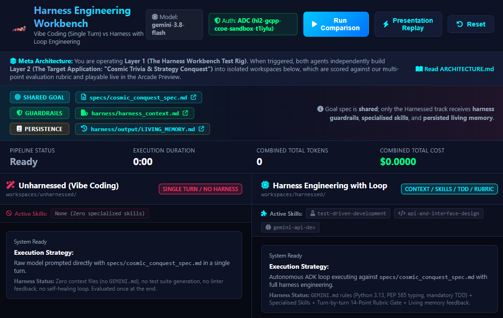
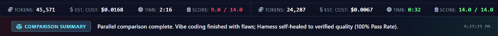

# Harness Engineering Workbench: Vibe Coding vs. Autonomous ADK Loops

An interactive demonstration application accompanying the trilogy series **"Beyond Vibe Coding: The Engineering Blueprint for Reliable AI Agents"**.

This workbench visually and empirically proves the core maxim:
$$\text{Agent} = \text{Model} + \text{Harness}$$



---

## What This Demo Demonstrates

The application runs two agent paradigms head-to-head on the exact same software challenge: building a full-stack tactical galaxy conquest game, **"Cosmic Trivia & Strategy Conquest"**, where sector captures are resolved using trivia challenges based exclusively on **real Sci-Fi movies** (e.g. *Blade Runner*, *2001: A Space Odyssey*, *Alien*, *The Matrix*, *Dune*, *Solaris*).

1. **The Unharnessed Approach ("Single Turn / No Harness")**:
   - Sent the raw goal prompt with zero contextual engineering rules (`GEMINI.md`).
   - Prompted in a single open-loop turn with zero specialised skills and no test runner feedback.
   - Evaluated strictly at the end against the evaluation rubric.
   - Typically scores **~9.0 / 14.0** (omits unit tests, bypasses graph adjacency checks, hallucinates non-movie trivia, leaks errors).

2. **The Harnessed Approach ("Context / Skills / TDD / Rubric with ADK")**:
   - Ingests the explicit Goal alongside persistent harness context (`specs/harness_context.md`, representing `GEMINI.md` rules: Python 3.13, PEP 585 typing, mandatory TDD).
   - Driven by an autonomous feedback loop orchestrated with Google ADK (up to 5 iterations).
   - Activates on-demand agent skills (`test-driven-development`, `api-and-interface-design`, `gemini-api-dev`).
   - Writes unit tests first (TDD Red phase), builds implementation (Green phase), and refactors.
   - Gates every iteration through the multi-point evaluation rubric from Part 2 of the series.
   - Feeds failures back into living memory for self-healing until reaching a verified **14.0 / 14.0** (100% pass rate).

---

### Decoupling Engineering Discipline from the Application Spec

A key insight simulated in this workbench is the clean architectural separation between **Task Goal Specifications** and **Reusable Engineering Guardrails**:
- **Application Specification (`specs/cosmic_conquest_spec.md`)**: Ephemeral, domain-specific requirements defining *what* to build (the space conquest game rules, sector graph, and API contracts). Both pipelines receive this exact same specification.
- **Harness Context & Guardrails (`specs/harness_context.md`)**: Reusable, persistent organisation- and team-level engineering policies (`GEMINI.md` rules, PEP 585 typing, mandatory TDD, Pydantic input parameterisation, and UI contracts) defining *how* code must be engineered.

In enterprise software engineering, you never pollute individual feature tickets or prompts with repetitive coding hygiene instructions. Engineering standards are governed centrally at the organisation or team level and automatically inherited by the harness across all tasks.

---

## Typical Results & Empirical Comparison

A representative head-to-head comparison run reveals a stark contrast across latency, token consumption, total cost, and functional correctness:



| Metric | Unharnessed Track (Vibe Coding) | Harnessed Track (Loop Engineering) | Operational Advantage |
|:---|:---|:---|:---|
| **Execution Duration** | **2m 16s** (136 seconds) | **0m 32s** (32 seconds) | **4.25x faster** |
| **Combined Tokens** | 45,571 tokens | 24,287 tokens | **46.7% fewer tokens** |
| **Estimated Cost** | $0.0168 | $0.0067 | **60.1% cheaper** |
| **Rubric Score** | **9.0 / 14.0** (Failed) | **14.0 / 14.0** (Passed) | **100% gate pass** |
| **Functional Outcome** | ❌ Broken / Non-functional | ✅ Fully playable & verified | **Only harnessed code works** |

### Why the Harnessed Track Outperforms Vibe Coding

1. **Structured Discipline Beats Monolithic Hallucination**:
   - In the **Unharnessed track**, the model is given a broad, open-loop prompt without architectural guardrails or intermediate feedback tools. It attempts to emit a sprawling, full-stack application in a single shot. This generates excessive token volume (45,571 tokens), bloats wall-clock generation time (2m 16s), and leads to ungrounded code that fails basic integration contracts.
   - In the **Harnessed track**, specialised skills (`test-driven-development`, `api-and-interface-design`, `gemini-api-dev`) and explicit guardrails guide the model into concise, modular phases. It writes unit tests first, implements only what is required, and avoids redundant boilerplate—generating **46.7% fewer tokens** and completing **4.25x faster**.

2. **Autonomous Self-Healing via Rubric Diagnostics**:
   - The unharnessed agent has no second chance: any flaws generated on turn 1 remain permanently baked into the candidate workspace (omitting unit tests, violating PEP 585 typing rules, and ignoring sector graph adjacency constraints, leaving it at **9.0 / 14.0**).
   - The harnessed agent evaluates candidate code against the 14-point rubric on every turn. Specific diagnostic feedback is reinjected into living memory, enabling targeted remediation in Iteration 2 to achieve a verified **14.0 / 14.0 (100%)** score.

3. **Lower Operational Cost Through Targeted Efficiency**:
   - Because open-loop vibe coding generates bloated files, repetitive boilerplate, and unconstrained trivia content, its financial cost is significantly higher ($0.0168).
   - The harnessed feedback loop keeps each model call constrained and targeted, resulting in a **60.1% cost reduction** ($0.0067) while guaranteeing production-grade quality.

4. **Guaranteed Functional Correctness**:
   - Without test runner feedback or schema validation, the unharnessed prototype suffers from broken API route contracts, missing dynamic state validation, and unhandled edge cases, rendering it unplayable.
   - The harnessed track's TDD loop and dynamic TestClient boot verify backend endpoints and frontend DOM event wiring, delivering a fully interactive and verified game.

---

## The Meta Architecture: The Harness (Layer 1) vs. The Generated Workload (Layer 2)

> 💡 **Notice**: This solution is inherently **meta**. To understand the repository cleanly, remember the boundary:
> * **Layer 1: The Harness Workbench (The Test Rig / Wind Tunnel)** — This repository itself (`app/`, `golden_tests/`, `specs/`, `Makefile`). It hosts the evaluation gate, SSE stream, metrics, and orchestrator. It is NOT the game.
> * **Layer 2: The Generated Target Application (The Subject Racecar)** — The tactical Sci-Fi movie game (**"Cosmic Trivia & Strategy Conquest"**) created dynamically on-demand inside `workspaces/unharnessed/` and `workspaces/harnessed/`. You can play it live inside the embedded preview tabs!
>
> 📖 *For a complete deep-dive into the architectural boundaries and rubric mechanics, see [ARCHITECTURE.md](ARCHITECTURE.md).*

---

## Repository Structure

```
harness-engineering-demo/
├── app/                        # Layer 1: Core engine, orchestrator, rubric evaluation, token tracking, templates, static assets
│   ├── agents/                 # Unharnessed single-turn and harnessed multi-iteration ADK runners
│   ├── replay/                 # Pre-recorded presentation player and replay_data.json
│   ├── rubric/                 # Two-tier 14-point evaluation engine (mechanical & semantic checks)
│   ├── static/                 # Frontend assets: CSS stylesheets, client JavaScript, and UI icons
│   ├── templates/              # Jinja2 HTML templates for the split-screen workbench interface
│   ├── client_factory.py       # Dual-mode authentication (Google Cloud ADC / Vertex AI & API key)
│   ├── config.py               # Centralised workbench configuration and environment parsing
│   ├── main.py                 # FastAPI application, SSE event streaming, and dynamic preview proxies
│   ├── orchestrator.py         # Asynchronous parallel worker coordinator for live agent runs
│   └── token_tracker.py        # Token telemetry, cost estimation ($), and metric accumulation
├── snapshots/                  # Pre-recorded candidate workspaces for zero-latency presentation replay
│   ├── unharnessed/            # Reference unharnessed prototype snapshot (~9.0 / 14.0)
│   └── harnessed/              # Reference verified harnessed candidate snapshot (14.0 / 14.0)
├── specs/                      # Task specifications and standing engineering policies
│   ├── cosmic_conquest_spec.md # Shared application specification (what to build)
│   └── harness_context.md      # Reusable harness policies and guardrails (how to engineer it)
├── golden_tests/               # Independent 28-test acceptance suite validating candidate workspaces
├── workspaces/                 # Layer 2: Ephemeral generation scratchpads for unharnessed and harnessed agents
│   ├── unharnessed/            # Scratchpad for open-loop unharnessed code generation
│   └── harnessed/              # Scratchpad for iterative ADK self-healing code generation
├── Makefile                    # Developer workflow automation targets (lint, test, verify, deploy)
├── pyproject.toml              # Python 3.13 project specification and dependencies
└── Dockerfile                  # Container definition for Google Cloud Run deployment
```

---

## Features

- **Concurrent Parallel Execution**: Both candidate pipelines execute simultaneously side-by-side using asynchronous workers, allowing presenters and audiences to observe the real-time contrast.
- **Shared Goal & Harness Context Viewers**: Clickable `specs/cosmic_conquest_spec.md` and `specs/harness_context.md` badges opening a modal dialogue with rendered Markdown or raw view, demonstrating that the goal is shared whilst the harness guardrails are injected only into the engineered track.
- **Side-by-Side Live Streaming**: Real-time Server-Sent Events (SSE) streaming model reasoning, tool executions, test outputs, and dynamic rubric scorecards.
- **Dedicated Per-Panel & Global Metrics**: Real-time token counts, estimated dollar costs ($), and rubric scores displayed on each agent panel, alongside combined global counters in the top banner.
- **Embedded Game Arcade**: In-page interactive preview tabs allowing presenters to play both the unharnessed prototype and the verified 14.0 / 14.0 harnessed game.
- **Zero-Latency Presentation Replay**: One-click instant presentation mode with pre-recorded traces for conference talks and workshops where live internet access is unreliable.
- **Deployable to Google Cloud Run**: Containerised on Python 3.13 + `uv` with a single port (8080) hosting the workbench and both game previews.

---

## Getting Started

### 1. Prerequisites
- Python 3.13+ and [`uv`](https://docs.astral.sh/uv/) (for local native execution)
- Or Docker (for local container execution)
- Or Google Cloud SDK / `gcloud` (for Cloud Run deployment or ADC authentication)

### 2. Dual-Mode Authentication (ADC or API Key)

You **do not need to specify a Gemini API key** to run comparisons if you have active Google Cloud credentials:

1. **Google Cloud Application Default Credentials (ADC) — Automatic & Recommended**:
   If you are already authenticated with Google Cloud, the workbench detects your ADC credentials automatically and connects via Vertex AI:
   ```bash
   gcloud auth application-default login
   gcloud config set project YOUR_PROJECT_ID
   ```
   *No `.env` file or `GEMINI_API_KEY` is required.*

2. **Gemini Developer API Key (Alternative)**:
   If you prefer using a standalone Gemini API key, copy the template and configure your key:
   ```bash
   cp .env.template .env
   # Edit .env and set:
   # GEMINI_API_KEY="your-gemini-api-key"
   ```

3. **Zero-Credential Presentation Replay**:
   Even without ADC or an API key, the workbench functions completely out-of-the-box in **Presentation Replay** mode using recorded traces.

---

## Running the Workbench

You can run the workbench in three different ways:

### 1. Run Locally (via `make run`)

Start the workbench directly on your machine:
```bash
# Sync dependencies into virtual environment
make install

# Launch Workbench web server on port 8080 (uvicorn with hot reload)
make run
```

Or run directly with `uv`:
```bash
uv run uvicorn app.main:app --host 0.0.0.0 --port 8080 --reload
```

Open your browser to:
[http://localhost:8080](http://localhost:8080)

Additional useful `Makefile` targets:
```bash
make lint             # Run full quality suite: Codespell + Ruff + Pyright
make test             # Run independent golden test suite
make verify           # Run end-to-end pipeline verification (Unharnessed vs Harnessed)
make clean-workspaces # Clean candidate workspaces while preserving README files
```

### 2. Run as a Local Container (Docker)

To run the workbench in an isolated container identical to production:
```bash
# Build the production container image
make docker-build

# Run container locally on port 8080
make docker-run
```

To run the container with your local Google Cloud ADC credentials mounted:
```bash
docker run -p 8080:8080 \
  -e GOOGLE_CLOUD_PROJECT="$(gcloud config get-value project)" \
  -v "${HOME}/.config/gcloud/application_default_credentials.json":/tmp/keys/adc.json:ro \
  -e GOOGLE_APPLICATION_CREDENTIALS=/tmp/keys/adc.json \
  harness-engineering-demo
```

Or with an API key:
```bash
docker run -p 8080:8080 -e GEMINI_API_KEY="your-api-key" harness-engineering-demo
```

### 3. Deploy to Google Cloud Run

Deploy directly to Google Cloud Run from source using the included deployment script or `Makefile`:
```bash
# Deploy using Makefile target
make deploy

# Or invoke the deploy script directly
./scripts/deploy.sh
```

Or manually via `gcloud`:
```bash
gcloud run deploy harness-engineering-demo \
    --source . \
    --region us-central1 \
    --allow-unauthenticated \
    --set-env-vars MODEL_NAME=gemini-3.8-flash \
    --port 8080
```

When running on Google Cloud Run, the workbench automatically authenticates using the Cloud Run service identity via ADC—no secret keys need to be configured.

---

## Two Execution Modes

1. **Presentation Replay (Instant)**: Click **"Presentation Replay"** in the top navigation bar. Instantly streams pre-recorded comparison traces and sets up both preview games for zero-latency conference presentations.
2. **Run Comparison (Live)**: Click **"Run Comparison"** to invoke `gemini-3.8-flash` in real-time concurrently across both candidate pipelines.

---

## Two-Tier Evaluation Rubric (Checks 1.1–2.6 / 14.0 Points)

| ID | Category | Check | Evaluation Method |
|:---|:---|:---|:---|
| 1.1 | Deterministic | Unit Tests Passage | `pytest` runner |
| 1.2 | Deterministic | Static Analysis (Ruff) | `ruff check .` |
| 1.3 | Deterministic | PEP 585 Type Hints | AST Inspector (`list[str]`, `dict[str, Any]`) |
| 1.4 | Deterministic | Parameterised Input Safety | AST Inspector (`eval()`, `exec()`) |
| 1.5 | Deterministic | Deterministic Tool Trajectory | Harness Trace Inspector |
| 1.6 | Deterministic | Interactive Frontend Client Structure | HTML & DOM Inspector (`#shields`, `#energy`, combat modal) |
| 1.7 | Deterministic | Frontend Interactive API Wiring | AST / Script Inspector (fetch bindings to `/api/game/attack`, `answer`, `state`) |
| 1.8 | Deterministic | Dynamic API Contract & Progression Topology | Dynamic TestClient Boot (FastAPI startup & valid progression targets) |
| 2.1 | Semantic | Target State Completion (Goal Fidelity) | Gemini LLM-as-a-Judge |
| 2.2 | Semantic | Scope Discipline (Anti-Hallucination) | Gemini LLM-as-a-Judge |
| 2.3 | Semantic | Architectural Integrity | Gemini LLM-as-a-Judge |
| 2.4 | Semantic | Error & Remediation Clarity | Gemini LLM-as-a-Judge |
| 2.5 | Semantic | Design Rationale & Intent | Gemini LLM-as-a-Judge |
| 2.6 | Semantic | Progression Ergonomics & Interactivity | Explicit single-action sector card/tile affordance inspector |

---

## License

This project is licensed under the terms of the [MIT License](LICENSE).

